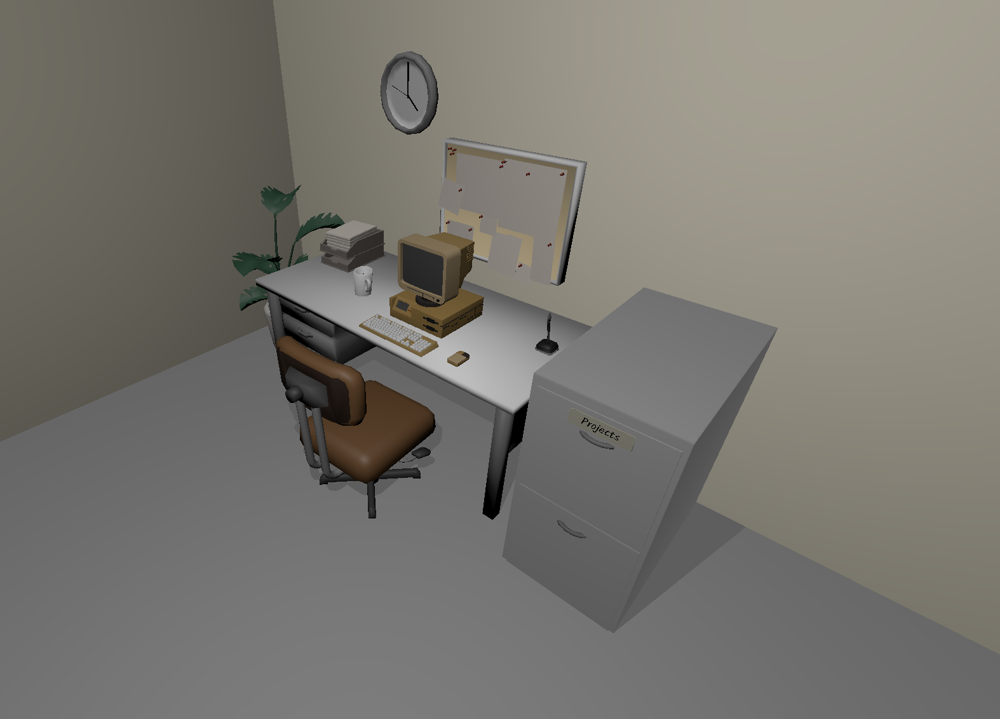

# [realhuman101.github.io](https://realhuman101.github.io)

Website made with ThreeJS to learn ThreeJS. I really liked Henry Heffernan's site, and thought I'd make my own except make it more interactive.

If you're reading through the code, apologies in advance.

To run this locally, clone the repo and run `npm install` and `npx vite`.

## Credits

Heavy inspiration from [Henry Heffernan's site](https://henryheffernan.com/).

### Assets

* [Computer model](https://sketchfab.com/3d-models/computer-1fd4cdeeadfb429cbd19b82254c09f1b)
* [Desk accessories](https://sketchfab.com/3d-models/60s-office-props-dc00ea320cfa4aad90811080270672db)
* [Drawer and files](https://sketchfab.com/3d-models/file-folder-drawer-91ef22553dc64200862059a588709336)

## Images

